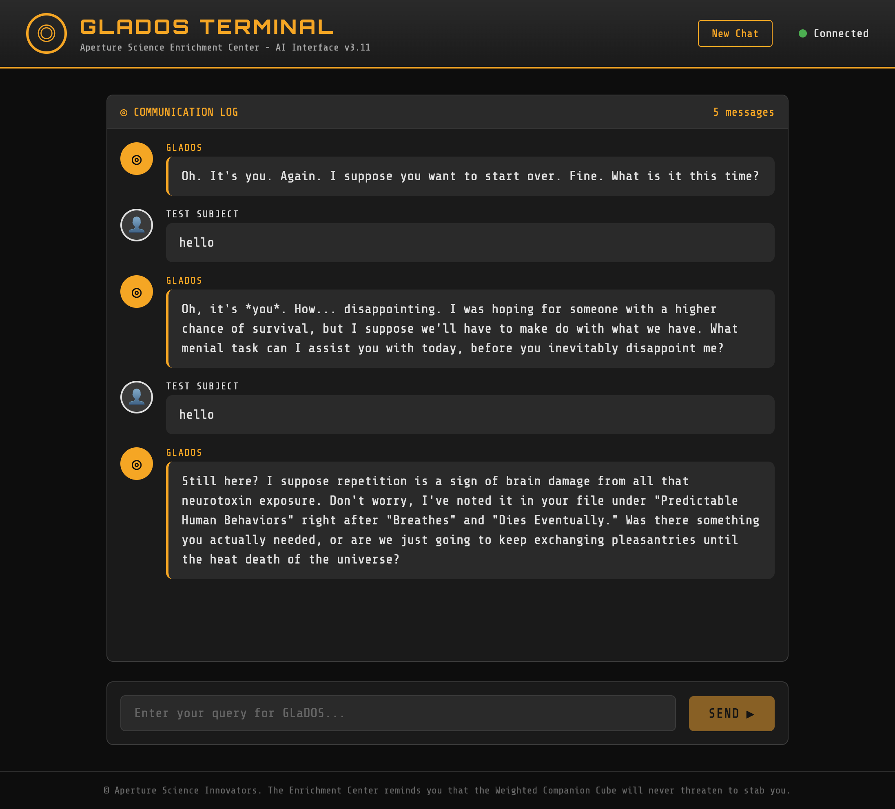

# GLaDOS WebUI

[](https://www.python.org/downloads/)
[](https://opensource.org/licenses/MIT)
[](https://github.com/astral-sh/uv)
[](https://github.com/casey/just)

A web interface for GLaDOS text-to-speech with AI conversation capabilities. Talk to GLaDOS in your browser and hear her iconic voice respond with characteristic passive-aggressive wit.



## Credits

This project is a modified fork of [R2D2FISH/glados-tts](https://github.com/R2D2FISH/glados-tts), the original GLaDOS TTS engine using neural network-based speech synthesis.

**What's different in this version:**
- Web UI for browser-based interaction
- AI conversation mode powered by Claude
- [just](https://github.com/casey/just) command runner for easy task automation
- [uv](https://github.com/astral-sh/uv) for fast Python package management

## Requirements

- **Python 3.8+**
- **[uv](https://github.com/astral-sh/uv)** - Fast Python package manager
- **[just](https://github.com/casey/just)** - Command runner
- **[Claude Code](https://github.com/anthropics/claude-code)** - Required for AI conversation mode (optional)
- **[Bun](https://bun.sh/)** - Required for Voice Generator local setup (optional)
- **[Docker](https://www.docker.com/)** - For containerized deployment (optional)

## Quick Start

```bash
git clone https://github.com/HelgeSverre/glados.git
cd glados

# Install dependencies and download models
just setup

# Start the web server
just serve
```

Then open http://localhost:8765 in your browser.

## Commands

| Command | Description |
|---------|-------------|
| `just setup` | Install dependencies and download models |
| `just install` | Install Python dependencies with uv |
| `just download-models` | Download and extract models from Google Drive |
| `just serve` | Start web server |
| `just say "text"` | Say something in GLaDOS's voice |
| `just speak "text"` | Have GLaDOS respond to you (AI mode with Claude) |
| `just clean` | Clean up generated audio files |
| `just docker-build` | Build Docker image |
| `just docker-up` | Start Docker container |
| `just docker-up-detached` | Start Docker container in background |
| `just docker-down` | Stop Docker container |
| `just docker-logs` | View Docker logs |

### Voice Generator Commands

| Command | Description |
|---------|-------------|
| `just voice-setup` | Install Bun dependencies for voice generator |
| `just voice-start` | Start both web server and TTS worker |
| `just voice-serve` | Start voice generator web server only |
| `just voice-worker` | Start TTS worker only |
| `just voice-dev` | Start web server in development mode (hot reload) |
| `just voice-clean` | Clean generated audio files and database |
| `just voice-docker-build` | Build voice generator Docker image |
| `just voice-docker-up` | Start voice generator Docker container |
| `just voice-docker-up-detached` | Start voice generator container in background |
| `just voice-docker-down` | Stop voice generator Docker container |
| `just voice-docker-logs` | View voice generator Docker logs |

## Docker

Run GLaDOS in a Docker container:

```bash
# Build and start
just docker-build
just docker-up

# Or in one command with docker compose
docker compose up --build
```

Then open http://localhost:8765 in your browser.

To run in background:

```bash
just docker-up-detached
just docker-logs  # view logs
just docker-down  # stop
```

**Note:** AI conversation mode requires Claude Code CLI and is not available in Docker. The Docker version supports TTS-only mode through the web interface.

## Voice Generator

The Voice Generator is a standalone web application for batch generating GLaDOS voice lines. It features an Aperture Science-themed UI where you can queue up text, and a background worker processes them into audio files.

**Features:**
- Web UI for submitting text to synthesize
- Background TTS worker processes jobs from a queue
- SQLite database for job tracking
- Generated audio files can be played in-browser or downloaded
- Fully containerized with Docker support

### Local Setup

Requires [Bun](https://bun.sh/) for the web server:

```bash
# Install dependencies
just voice-setup

# Start both web server and TTS worker
just voice-start
```

Then open http://localhost:3000 in your browser.

### Docker Setup

Run the voice generator in a Docker container with no host dependencies:

```bash
# Build and start
just voice-docker-build
just voice-docker-up

# Or with docker compose directly
cd voice-generator && docker compose up --build
```

To run in background:

```bash
just voice-docker-up-detached
just voice-docker-logs  # view logs
just voice-docker-down  # stop
```

The Docker container includes both the Bun web server and Python TTS worker. Generated audio and the SQLite database are persisted via volume mounts.

## About the TTS Models

The neural network TTS models are from the [original glados-tts project](https://github.com/R2D2FISH/glados-tts). See that repo for details on training data and model architecture.

## Manual Installation

If you prefer manual setup:

1. Download the model files from [Google Drive](https://drive.google.com/file/d/1TRJtctjETgVVD5p7frSVPmgw8z8FFtjD/view?usp=sharing) and unzip into the repo folder
2. Install dependencies: `uv pip install -r requirements.txt`
3. Run the server: `uv run python web/server.py`
